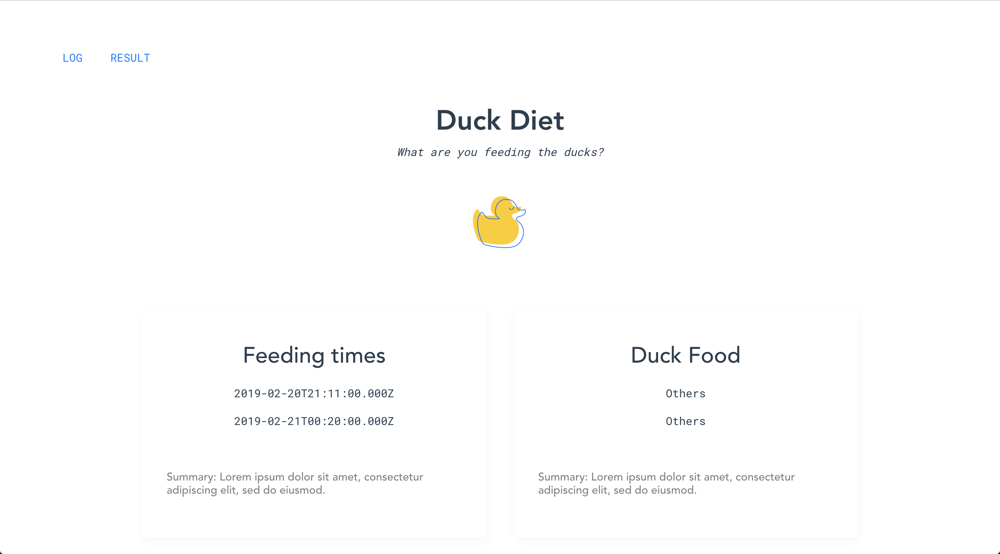
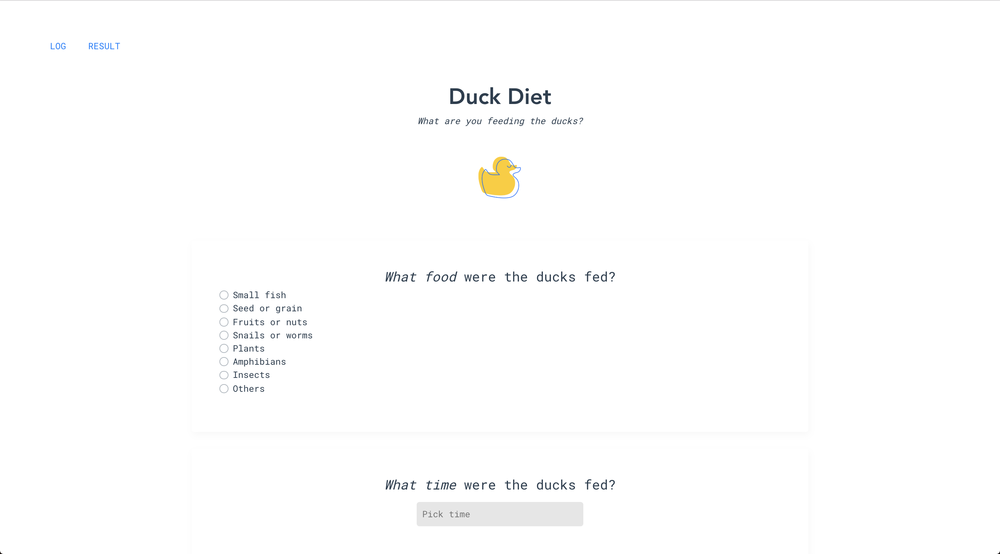

# myduckdiet

> A ducking Vue.js project

## What is this?

This is a VueJS web app. Users can log what they've fed ducks!




##### Scenario:

A scientist is trying to understand how ducks are being fed in parks around the world. She wants
to collect the following information:

- What time the ducks are fed
- What food the ducks are fed
- Where the ducks are fed
- How many ducks are fed
- What kind of food the ducks are fed
- How much food the ducks are fed

## What was used?

Packages, resrouces, and tools used in this app:

- [BootstrapVue](https://bootstrap-vue.js.org/)
- [Vue Router](https://router.vuejs.org/)
- [Firebase](https://firebase.google.com/)
- [Vue DateTime](https://www.npmjs.com/package/vue-datetime)
- [Reference YouTube tutorial](https://www.youtube.com/watch?v=L6FPznKU5eA)
- [Reference deploying article I](https://medium.com/@ShayneOSullivan/deploy-a-vue-js-app-with-firebase-hosting-3fc420cf3998)
- [Reference Vue article II](https://medium.com/codingthesmartway-com-blog/vue-js-2-firebase-e4b2479e35a8)

## Build Setup

```bash
# install dependencies
npm install

# serve with hot reload at localhost:8080
npm run dev

# build for production with minification
npm run build

# build for production and view the bundle analyzer report
npm run build --report
```
